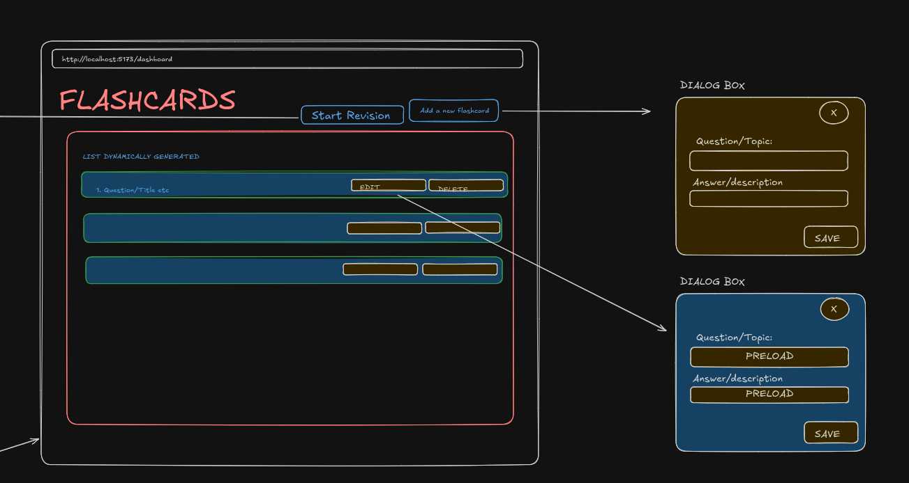
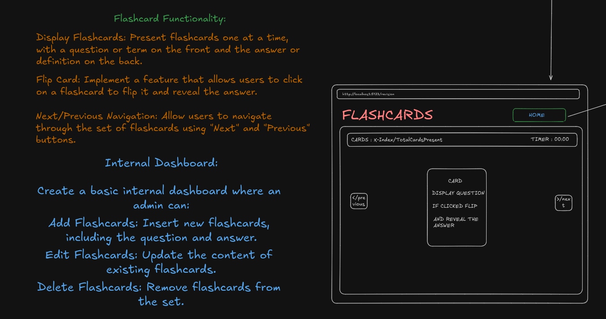

# 📚 Flashcard Learning Tool

Welcome to the Flashcard Learning Tool! This project is designed to help users study and learn using flashcards, with a focus on simplicity and efficiency. The tool includes both a frontend and a backend, allowing for a fully functional application with database integration.

## 🌟 Features

- **Flashcards Display**: Users can view flashcards one at a time, with the option to flip them to see the answer.
- **Navigation**: Easily navigate through flashcards using "Next" and "Previous" buttons.
- **Admin Dashboard**: Add, edit, or delete flashcards through a user-friendly internal dashboard.
- **Database Integration**: All flashcards are stored in a PostgreSQL database, ensuring data persistence and integrity.
- **Reverse Proxy & Caching**: Frontend files are served through a reverse proxy on an EC2 instance with Redis caching for improved performance.

## 🛠️ Tech Stack

### Frontend
- **React.js**
- **Tailwind CSS**
- **Framer Motion**
- **shadcn**
- **axios**
- **Vite**
- **TypeScript**

### Backend
- **PostgreSQL (NeonDB)**
- **TypeScript**
- **Node.js**
- **Express**
- **Redis**
- **Zod**
- **Prisma**

## 📂 File Structure

```bash
├── frontend/
│   ├── src/
│   ├── public/
│   ├── index.html
│   ├── package.json
│   └── vite.config.ts
└── backend/
    ├── src/
    ├── prisma/
    ├── node_modules/
    ├── package.json
    └── tsconfig.json
```

## 🚀 Getting Started

### Prerequisites

- Node.js
- PostgreSQL (NeonDB)

### Installation

#### 1. Clone the repository

```bash
git clone https://github.com/yourusername/flashcard-tool.git
cd flashcard-tool
```

#### 2. Set up the Backend

Navigate to the `backend` directory and install dependencies:

```bash
cd backend
npm install
```

Set up the Prisma schema and migrate the database:

```bash
npx prisma migrate dev
```

Start the backend server:

```bash
npm run dev
```

#### 3. Set up the Frontend

Navigate to the `frontend` directory and install dependencies:

```bash
cd ../frontend
npm install
```

Start the frontend development server:

```bash
npm run dev
```

### 4. Environment Variables

Create a `.env` file in both `frontend` and `backend` directories and add necessary environment variables:

**Frontend `.env`**:
```
VITE_API_URL=http://localhost:8080
```

**Backend `.env`**:
```
DATABASE_URL=your_postgresql_database_url
```

### Initial Design




### Additional Enhancements

- **Reverse Proxy**: The frontend files are served through a reverse proxy on an EC2 instance.
- **Caching**: Redis is used for caching user data to improve performance.
- **Zod Validation**: Zod is utilized for type validation, ensuring that errors are caught during runtime rather than in production.

## 🤝 Contributing

Contributions are welcome! Please fork this repository and create a pull request to propose changes.

## 📝 License

This project is licensed under the MIT License.

